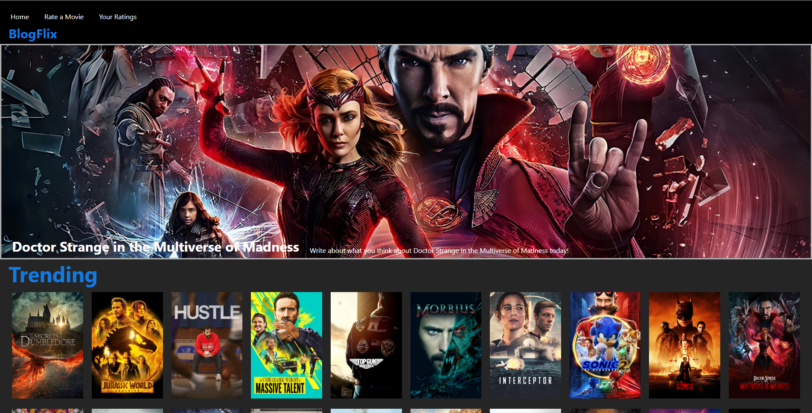

# "BlogFlix"

A project created in order to have a place where an individual can rate and write their thoughts about a movie they have seen.
It displays trending movies, movies that are currently in theatres and also the top rated movies.

# Preview

<ul>
  <li>The Home page displays a random movie thats trending as its banner </li>
  <li>The Navbar can take users to their ratings that they have made and takes them to a form where they can submit new ratings </li>
  <li>Also displays Trending, Now Playing, and Top Rated movies </li>
</ul>

# Technologies 
This web-app was created using JavaScript, HTML, CSS.
<ul>
  <li>Frontend: React.js </li>
  <li>Backend: Node.js, Express.js </li>
  <li>Database: MongoDB </li>
</ul> 
  Also used TMDB API for movie data - Visuals, Trending, Now-Playing, etc.

  
  

